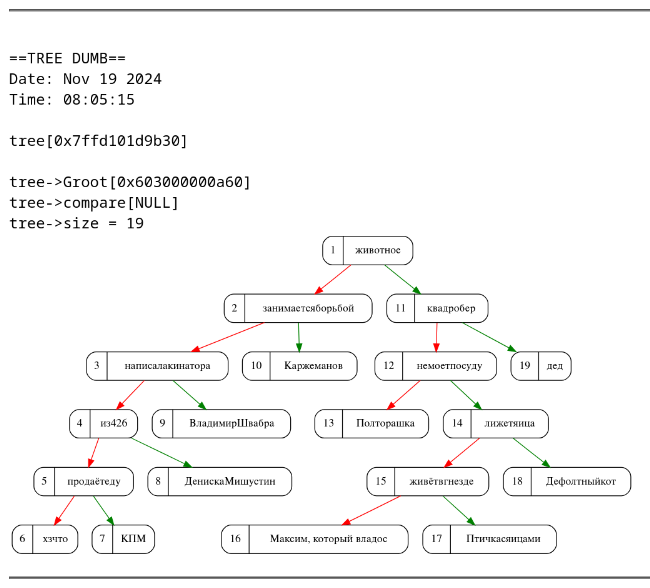

# Аkinator

Проект представляет собой консольную игру, вдохновлённую известной игрой "Акинатор". Основой игры является бинарное дерево поиска, в котором:
- **Листья** хранят объекты (например, персонажей), которые можно угадывать.
- **Внутренние узлы** содержат вопросы, на которые пользователь отвечает "да" или "нет".

Дерево динамически расширяется: если программа не смогла угадать загаданный объект, она добавляет его в дерево, с пользовательским вопросом, который отличает новый объект от предполагаемого.

Реализован графический дамп дерева, а также есть поддержка озвучки текста при помощи утилиты Festival.

## Установка и запуск

### Зависимости
- **Graphviz**: Для визуализации дерева.
- **GCC**: Для сборки проекта.
- **Make**: Для управления сборкой проекта
- **Festival**: Для озвучки текста (должна быть поддержка русского языка)

### Сборка и запуск
1. Клонируйте репозиторий с проектом:
    ```bash
    git clone https://github.com/kzueirf12345/akinator
    cd path/to/akinator/
    ```
2. Соберите и запустите проект:
   ```bash
   make
   ```

## **Функционал игры**

1. **Угадывание объекта**:
   - Программа проходит по дереву, задавая вопросы, которые находятся в нодах. А в зависимости от ответа идёт в левое или правое поддерево
   - Если объект не найден, программа добавляет его в дерево.

2. **Характеристика объекта**:
   - Программа во время поиска объекта в дереве записывает в стек все вопросы до текущей ноды, а при нахождении выводит их (если ответ "нет", то с соответствующей приставкой)

3. **Сравнение объектов**:
    - У 2 объектов определяется их наименьший общий предок (LCA).
    - Выводятся:
        - Общие характеристики (вопросы от корня до LCA).
        - Ключевое отличие (вопрос в LCA).
        - Уникальные характеристики каждого объекта (вопросы от LCA до листа).

4. **Загрузка дерева**:
   - Дерево сохраняется в текстовый файл в формате внутреннего представления.
   - Пример формата:
     ```plaintext
     {
         'животное'
         lt
         rt
         {
             'квадробер'
             lt
             {
                 'не моет посуду'
                 lt
                 {
                     'Полторашка'
                     lt
                     rt
                 }
                 rt
             }
             rt
             {
                 'дед'
                 lt
                 rt
             }
         }
     }
     ```
4. **Сохранение дерева**:

    Дерево загружается из указанного файла с внутренним представлением

5. **Режим тестирования**:
   
   Режим для разработчиков

## Реализация

### **Бинарное дерево поиска**
Дерево реализовано как структура, где каждая нода содержит:
- **Данные (`void*`)**: Могут быть любого типа, поэтому данное дерево можно использовать не только в этом проекте.
- **Указатели на левое и правое поддеревья**: Левый узел соответствует ответу "нет", правый — "да".

#### Ключевые функции для работы с деревом:
- **Добавление элемента**: Если объект не найден, программа добавляет его в дерево, задавая пользователю вопрос для различия.
- **Поиск элемента**: Используется для угадывания объекта и поиска характеристик.
- **Верификация дерева**: Проверка корректности структуры дерева (используется только в дебажном режиме).
- **Графический дамп**: Визуализация дерева с помощью Graphviz.


### **Озвучка текста**

В развлекательных целях в проект была добавлена возможность озвучки текста с использованием библиотеки **Festival**.

#### Реализация
Озвучка реализована в модуле `voicing`, который использует системный вызов `system` для взаимодействия с Festival. Основная функция `voicing` принимает форматированную строку (аналогично `printf`) с аргументами и передаёт всё в Festival для воспроизведения.

#### Включение и отключение озвучки
Озвучка включается при определении макроса `VOICING_ON` во время компиляции.
```bash
make ADD_FLAGS="-DVOICING_ON"
```

